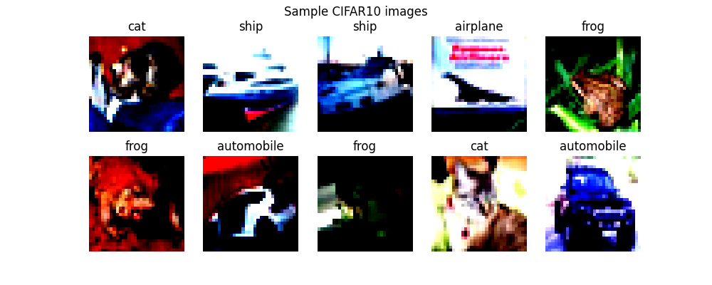
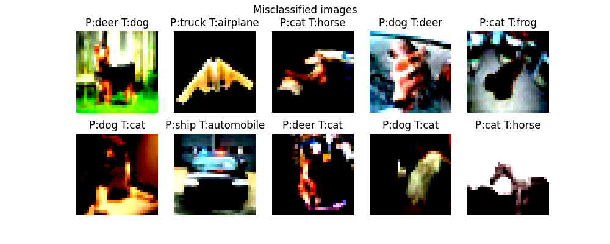
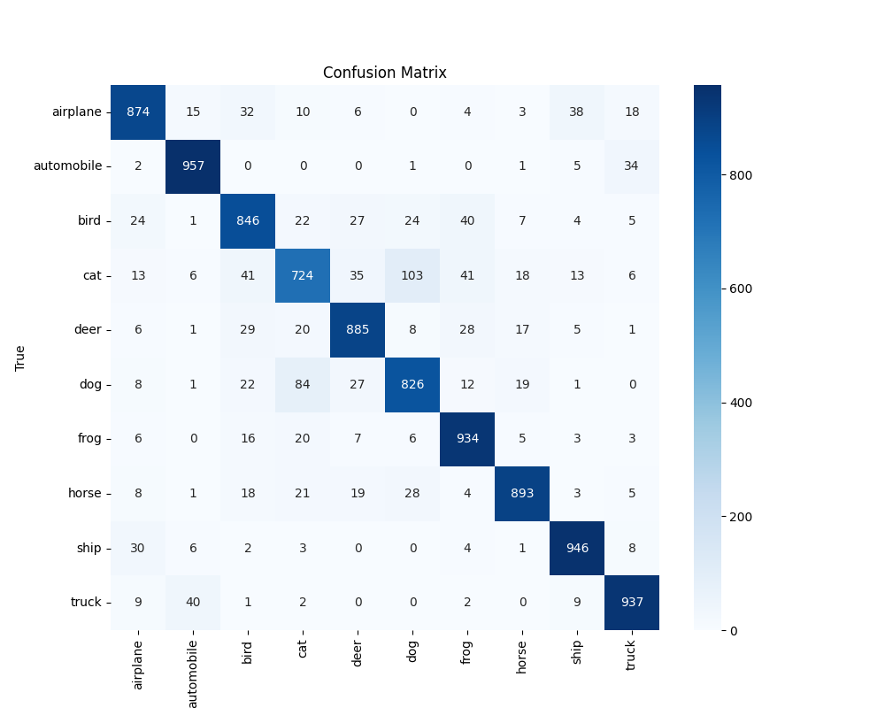
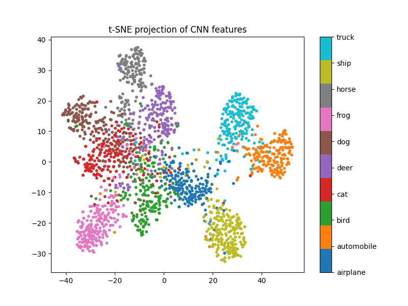
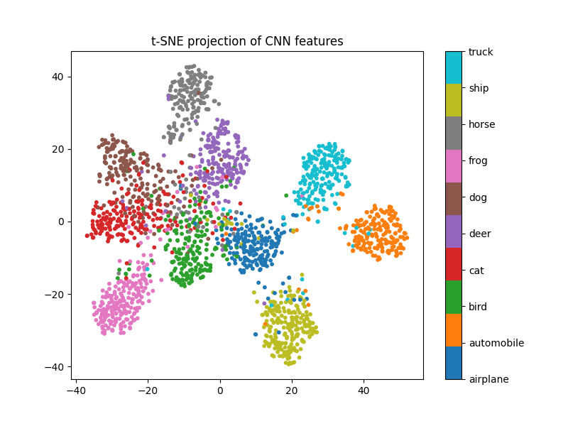

# Classification d’images CIFAR-10 avec PyTorch

Ce projet entraîne plusieurs réseaux de neurones convolutionnels (CNN) pour classifier des images du dataset CIFAR-10.

L’objectif du projet est de comprendre :

- l’entraînement d’un réseau convolutionnel
- l’impact de différentes architectures CNN
- l’évaluation des performances d’un modèle de classification
- la visualisation des représentations apprises par le réseau
- l’utilisation de techniques avancées d’entraînement avec PyTorch

Le projet est implémenté avec la bibliothèque **PyTorch**.

Au-delà d’un entraînement classique, ce projet explore également plusieurs techniques utilisées dans les pipelines modernes d’apprentissage profond :

- **data augmentation** pour améliorer la généralisation
- utilisation de l’optimiseur **AdamW**
- **label smoothing** dans la fonction de perte
- **learning rate warmup**
- **Cosine Annealing learning rate scheduler**
- **gradient clipping** pour stabiliser l’apprentissage

L’objectif est d’aller plus loin qu’un simple exemple de classification et d’expérimenter différentes stratégies d’entraînement afin d’observer leur impact sur les performances du modèle.

# Dataset

Le dataset utilisé est **CIFAR-10**, un dataset très utilisé pour les tâches de classification d’images.

Caractéristiques du dataset :

- 50 000 images d’entraînement  
- 10 000 images de test  
- images en couleur (RGB)  
- taille : **32 × 32 pixels**
- **10 classes d’objets**

Les classes sont :

[ airplane, automobile, bird, cat, deer, dog, frog, horse, ship, truck ]

Chaque image représente un objet appartenant à l’une de ces catégories.


# Prétraitement des données

Pour améliorer la généralisation du modèle, plusieurs techniques de **data augmentation** sont utilisées :

- **Random Horizontal Flip** : retourne aléatoirement les images horizontalement pour augmenter la diversité des données.
- **Random Crop avec padding** : recadre aléatoirement une partie de l’image après avoir ajouté un léger padding, ce qui rend le modèle plus robuste aux variations de position.
- **Random Rotation** : applique une petite rotation aléatoire aux images afin d’améliorer la capacité du modèle à reconnaître les objets sous différents angles.
- **Color Jitter** : modifie légèrement la luminosité et le contraste pour rendre le modèle plus robuste aux variations d’éclairage.

---

# Architecture du modèle

Le modèle utilisé est un **réseau convolutionnel modulaire**.

Chaque bloc convolutionnel contient :

- Convolution 3×3
- Batch Normalization
- ReLU
- Convolution 3×3
- ReLU
- MaxPooling

Après l’extraction des caractéristiques :

- Adaptive Average Pooling
- couche fully connected
- Dropout
- classification finale en **10 classes**

L’architecture est paramétrable avec la liste :
```
channels = [3, C1, C2, C3]
```

où :

- **3** correspond aux canaux RGB de l’image d’entrée
- **C1, C2, C3** définissent le nombre de filtres convolutionnels dans chaque bloc
- augmenter ces valeurs permet d’augmenter la capacité du modèle

Cette approche permet de tester facilement plusieurs architectures sans modifier l’implémentation du réseau.

---

# Architectures testées

Dans ce projet, plusieurs architectures CNN sont entraînées afin de comparer leurs performances.

Architecture 1 :

```
[3, 48, 96, 128]
```

Architecture 2 :

```
[3, 64, 128, 128]
```

Chaque architecture est entraînée séparément et le **meilleur modèle est sauvegardé automatiquement** pendant l’entraînement.

Les modèles sont enregistrés sous la forme :

```
cnn_best_<architecture>.pth
```

Par exemple :

```
cnn_best_3_64_128_128.pth
```

---

# Configuration de l'entraînement

Les paramètres utilisés pour l’entraînement sont :

Batch size : **64**  
Optimiseur : **AdamW**  
Learning rate initial : **0.0001**  
Learning rate maximum : **0.001**  
Weight decay : **1e-4**  
Fonction de perte : **CrossEntropyLoss avec label smoothing**  
Nombre d’epochs : **20**

Plusieurs techniques sont utilisées pour améliorer la stabilité de l’apprentissage :

- **Learning rate warmup** : le taux d’apprentissage commence avec une valeur faible puis augmente progressivement pendant les premières epochs. Cela permet de stabiliser le début de l’entraînement et d’éviter des mises à jour trop brutales des poids.

- **Cosine Annealing scheduler** : le learning rate diminue progressivement selon une courbe en cosinus au cours de l’entraînement. Cela permet d’affiner l’apprentissage en réduisant progressivement la taille des mises à jour.

- **Gradient clipping** : les gradients sont limités à une valeur maximale afin d’éviter qu’ils deviennent trop grands, ce qui pourrait rendre l’entraînement instable.

Pendant l’entraînement :

- la précision sur l’ensemble de test est calculée à chaque epoch
- le meilleur modèle est automatiquement sauvegardé

À la fin de l’entraînement, le script affiche également **l’architecture ayant obtenu la meilleure accuracy**.


# Visualisations

Un second script permet de générer différentes visualisations pour analyser le comportement du modèle.

Toutes les figures sont enregistrées dans le dossier :

```
images/
```

avec un sous-dossier pour chaque modèle.

---

## Exemples d’images du dataset



Quelques exemples d’images provenant du dataset CIFAR-10.

---

## Images mal classifiées



Affiche des exemples d’images que le modèle a mal classées.

Pour chaque image :

- **P** : prédiction du modèle  
- **T** : label réel

Ces erreurs apparaissent souvent pour des classes visuellement proches, par exemple :

- cat / dog  
- automobile / truck  
- deer / horse  

---

## Matrices de confusion

### Modèle CNN [3, 48, 96, 128]



### Modèle CNN [3, 64, 128, 128]


Les matrices de confusion montrent combien de fois chaque classe est confondue avec une autre.

Un modèle parfait produirait une matrice uniquement diagonale.

Pour les deux architectures, la majorité des prédictions se situe sur la diagonale, ce qui signifie que la plupart des images sont correctement classifiées.

On observe néanmoins certaines confusions entre des classes visuellement similaires, par exemple :

- **cat / dog**
- **automobile / truck**
- **deer / horse**

Le modèle **[3, 64, 128, 128]**, légèrement plus profond, tend généralement à produire une diagonale plus marquée, indiquant une meilleure capacité de classification.

---

## Visualisation t-SNE

### Modèle CNN [3, 48, 96, 128]



### Modèle CNN [3, 64, 128, 128]



La méthode **t-SNE** permet de projeter les représentations apprises par le réseau dans un espace en **2 dimensions**.

Pour les deux modèles, les images appartenant à la même classe forment des groupes (clusters), ce qui montre que les réseaux apprennent des représentations pertinentes des images.

Cependant, avec l’architecture **[3, 64, 128, 128]**, les clusters apparaissent plus compacts et mieux séparés, ce qui suggère que le modèle apprend des caractéristiques plus discriminantes.

# Exécution du projet

Pour entraîner les modèles :

```bash
python train.py
```

Les meilleurs modèles seront sauvegardés dans des fichiers `.pth`.

Pour générer les visualisations :

```bash
python visualize.py
```

Toutes les figures seront enregistrées dans le dossier :

```
images/
```