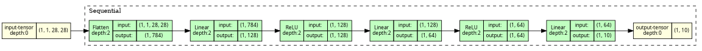
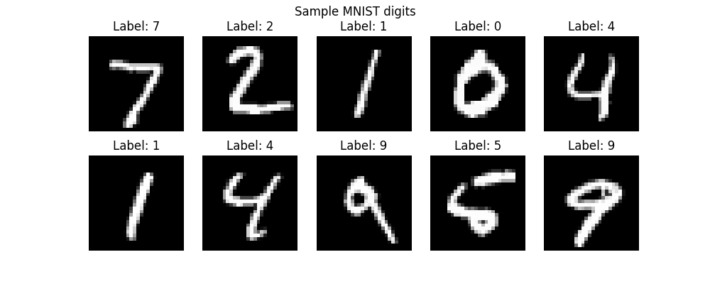
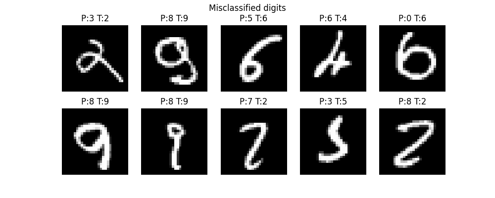
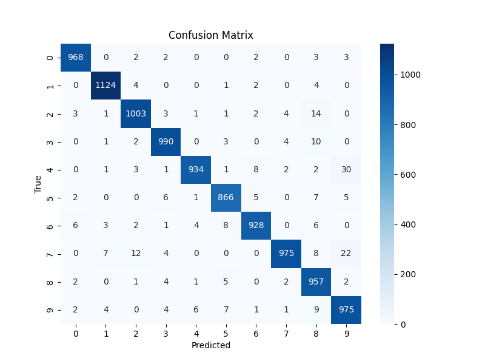
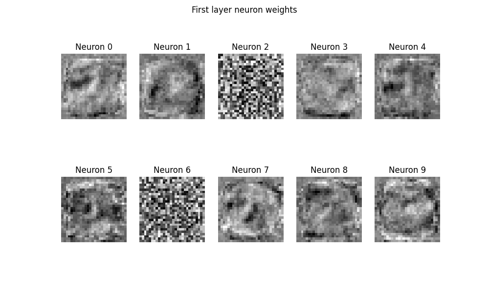
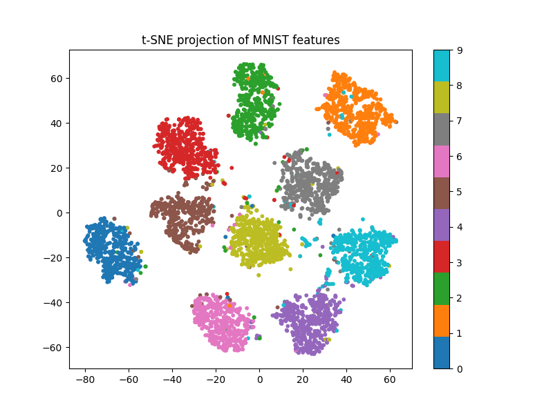

# Classification de chiffres manuscrits avec PyTorch

Ce projet entraîne un réseau de neurones pour classifier des chiffres manuscrits à partir du dataset MNIST.

L’objectif du projet est de comprendre :
- l’entraînement d’un réseau de neurones
- l’évaluation d’un modèle de classification
- la visualisation des représentations apprises par le réseau

Le modèle est implémenté avec la bibliothèque PyTorch.


# Dataset

Le dataset utilisé est MNIST, un dataset classique pour les tâches de classification d’images.

Caractéristiques du dataset :

- 60 000 images d’entraînement
- 10 000 images de test
- images en niveaux de gris
- taille : 28 × 28 pixels
- 10 classes correspondant aux chiffres de 0 à 9

Chaque image représente un chiffre manuscrit.


# Architecture du modèle

Le classificateur est un réseau de neurones entièrement connecté (fully connected).

Architecture :

<p align="center">
  
</p>


# Configuration de l'entraînement

Paramètres utilisés pour l'entraînement :

Batch size : 128  
Optimiseur : Adam  
Learning rate : 0.001  
Fonction de perte : CrossEntropyLoss  
Nombre d’epochs : 6  

Le modèle est entraîné sur l’ensemble d'entraînement puis évalué sur l’ensemble de test.

Après l’entraînement, le modèle est sauvegardé dans le fichier  mnist_model.pth


# Résultats

Après l'entraînement, le modèle atteint environ :

Accuracy ≈ 97–98 % sur l’ensemble de test.

Ce résultat est attendu pour un réseau entièrement connecté simple appliqué au dataset MNIST.


## Exemples d’images du dataset


Quelques exemples d’images provenant du dataset de test.


## Chiffres mal classifiés



Affiche des exemples d’images que le modèle a mal classées.

Pour chaque image : P = prédiction du modèle  et T = label réel

Ces erreurs apparaissent souvent pour des chiffres visuellement similaires.


## Matrice de confusion




La matrice de confusion montre combien de fois chaque chiffre est confondu avec un autre.  
Un modèle parfait produirait une matrice uniquement diagonale.

On observe que la grande majorité des prédictions se situe sur la diagonale, ce qui signifie que la plupart des chiffres sont correctement identifiés par le modèle. Les erreurs restent relativement rares.

On peut également remarquer que les erreurs les plus fréquentes concernent des chiffres qui se ressemblent visuellement, comme par exemple 9 et 4 ou encore 8 et 2. Cela s’explique par la similarité de certaines écritures manuscrites, qui peuvent rendre la distinction plus difficile pour le modèle.


## Visualisation des poids des neurones



Affiche les poids des neurones de la première couche.

Chaque neurone apprend à détecter certains motifs dans l’image, par exemple :

- des traits
- des courbes
- des structures verticales ou horizontales

Cela montre comment le réseau extrait des caractéristiques des images.

---

## Visualisation t-SNE



La méthode t-SNE permet de projeter les représentations apprises par le réseau dans un espace en 2 dimensions. Les images appartenant à la même classe forment des groupes (clusters). Cela montre que le réseau apprend une représentation pertinente des chiffres.

---

# Exécution du projet

Pour entraîner le modèle :

```bash
python train.py
```
Pour générer les visualisations :

```bash
python visualize.py
```

Toutes les figures seront enregistrées dans le dossier images/.